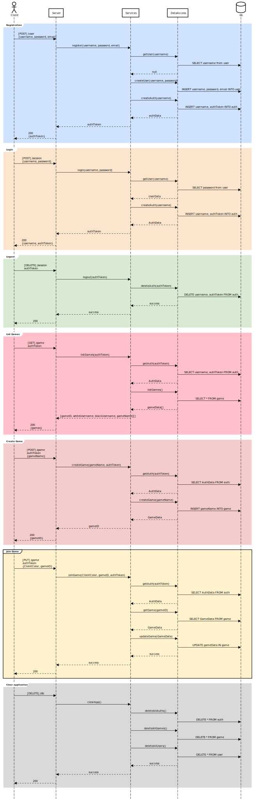

# ♕ BYU CS 240 Chess

This is a project for BYU CS 240 (Advanced Programming Concepts) that implements a multiplayer chess server and a 
command line chess client.  

This project demonstrates mastery of proper software design, client/server architecture, networking using HTTP and 
WebSocket, database persistence, unit testing, serialization, concurrency, and security.  

## Using the Live Server

The chess server is deployed to an AWS EC2 instance. 

A simple frontend can be accessed [here](https://chess.family-tasks.app) and contains an interface for making all the 
http API calls as documented below. To play a game through the command-line client, download and run the included 
`client.jar` file.

## Architecture Overview

The application implements a multiplayer chess server and a command line chess client.

[](https://sequencediagram.org/index.html#initialData=C4S2BsFMAIGEAtIGckCh0AcCGAnUBjEbAO2DnBElIEZVs8RCSzYKrgAmO3AorU6AGVIOAG4jUAEyzAsAIyxIYAERnzFkdKgrFIuaKlaUa0ALQA+ISPE4AXNABWAexDFoAcywBbTcLEizS1VZBSVbbVc9HGgnADNYiN19QzZSDkCrfztHFzdPH1Q-Gwzg9TDEqJj4iuSjdmoMopF7LywAaxgvJ3FC6wCLaFLQyHCdSriEseSm6NMBurT7AFcMaWAYOSdcSRTjTka+7NaO6C6emZK1YdHI-Qma6N6ss3nU4Gpl1ZkNrZwdhfeByy9hwyBA7mIT2KAyGGhuSWi9wuc0sAI49nyMG6ElQQA)

# API
| Endpoint                | HTTP Method | Path      | Header    | Body                        | Returns                                            |
|-------------------------|-------------|-----------|-----------|-----------------------------|----------------------------------------------------|
| Register                | POST        | /user     |           | {username, password, email} | authToken                                          |
| Login                   | POST        | /session  |           | {username, password}        | authToken                                          |
| Logout                  | DELETE      | /session  | authToken |                             | {}                                                 |
| List Games              | GET         | /game     | authToken |                             | {gameID, whiteUsername, blackUsername, gameName}[] |
| Create Game             | POST        | /game     | authToken | {gameName}                  | gameID                                             |
| Join Game               | PUT         | /game     | authToken | {ClientColor, gameID}       | {}                                                 |
| Clear Application       | DELETE      | /db       |           |                             | {}                                                 |

## Sequence Diagram
[Click to view online](https://sequencediagram.org/index.html?presentationMode=readOnly#initialData=IYYwLg9gTgBAwgGwJYFMB2YBQAHYUxIhK4YwDKKUAbpTngUSWOZVYSgM536HHCkARYGGABBECE5cAJsOAAjYBxQxp8zJgDmUCAFdsMAMQgAZigBMJkzABKKTUg5gowpBDRGA7gAskYFJiIqKQAtAB8LNSUAFwwANoACgDyZAAqALowAPS6ylAAOmgA3rmUaMAAtigANDC4HBye0NK1KBXASAgAvpgUUbDhkWySHLFQ9o7+UAAUpVDlVbX1jc2t7Z0AlL2s7Bwwg0Ii4iOjMJooYACqebN5Cyhbh2ISUvsRarFkAKIAMl9wqRgc3uMBMOgqQLymCex1eIUGfWGnFiaF0CAQ22ouzeMBhLwasRA42EKGulFuZUqNTqShWUGkjzksIaOI+MAAkgA5b42QHAqlLWlNelrDoIDmc1JJSG0RHYg5M-GnIkoEmiXRgbwU+ZUxlHJWs+SxLk8vl3AUwYAa7ypCAAa3QEqllut0MVJ32CJ2I1iVs1T0xSL28IiiJiLs1todaEDlE9ESC6DAsXMAAZU4Uin6bfb0D10NINNo9AZDCZJABWEDSGA-CAODyGHx+AKJ0Kh1jhxIpDLZZQNNxoTP8xY0hrC6Q9MMDDtYn0wBD1pBobX3QXj5pbOUjHF4k6xc5XG4jh5u-UewYfb5-AFjuk1sEQCFzM-PC9eufImBkqAB7ecXd3SkQliX8dVNVXXVX2ZYN3iNE0vl5GUdVHbMo0dLlnWzaCDRDIZdlicDvD-b0ALw6dfWtdCY2neN4GQJMU3TYdzVQqjczQfM0ELLQdH0IxpAATlVaQAGZa3rPRmCbXx-ECBj2yGLsBF+L5Ui+TIsn7DhB0KNCONjGd8PnRdNCk6Z9OjLdSNg3EgIJVQUAQC4UCIiz2KsnCLzg2IVL+dTkLXCMc2jGAADEbCSABZYKvLhD8g2iDhdCVQN5QSmJktS2i8LbZMYDTVNMALDReJLIxsGXO1a0mGAAHEqT2GSW3k4JmAyqBYjiOq1M0zQqT0jz0EMnF-1OZAnAaqoOHcyMOOsz9bL3YDDzcyz0D1N84R88hVNvE9anWjwIui2LlpZcibMI60SMWwDz2AiawCmzhpk2mDDU+PbAQAKnCyKYv6qo4ou0NvrORr-tOoHOBB4MEoIiGqieOJ0jSndLv6LqYfZARambfwfyC+QEFAO0iYtGHOSpdJUZG3KFPywrMxhjguJ44t+LLAAWCQJHgUCVBerxZNbRnRs7Tr4mSNI+oG8ohqHYoqapKdJYlxaQNVfwXumFW2LmzyxvuraCVW61ZpCja4c+3ab0BIinihmLsPO+HZ0SmBHbkdGyIiN3ohVEldf1083c+hCkNDp1pRhm3Mc9l7bqDOiKKRlBcfpwY8uiZnlapXH2aLPjSysExzH5gApCBl3qqkjBJsnWqTDWaClxJLl7LIYcGw30EzPK4AgRcoFqHGBDV-pW8RgArGu0F1wfh+gMeC7x4LqIWlOFQes2LjWxX3twnbr3+B2brkZ2zvs93jK-L2L5EX2lpv6JDxDtej+81QjVP28k8vidQG9d44I3nAAp+xsd6m1GPoWQOsqTTAgcAL+20f7REuAkAQogAowydlydOoCPYESyicZ+qdJZJRSmQnK2dGa53TMVbixdyqGCEuwwS9FVSwGANgbAyAQCuHcCLFqeVW7KVUupTSah6bEJ9CAZyeBRB8LeuQ6BMFojSCci5UQ6IiIzVQaDdBfk1JfBgH9IBsUoH+1flo5yYF0QvQMfHHyJiAoWIBoQ6xdld6jDsTo9EP5nHh0vEaNxZiPGnRfCEsByJSFSDUR1Kh2V1YMzagwoqBYgA)

[](https://sequencediagram.org/index.html?presentationMode=readOnly#initialData=IYYwLg9gTgBAwgGwJYFMB2YBQAHYUxIhK4YwDKKUAbpTngUSWOZVYSgM536HHCkARYGGABBECE5cAJsOAAjYBxQxp8zJgDmUCAFdsMAMQgAZigBMJkzABKKTUg5gowpBDRGA7gAskYFJiIqKQAtAB8LNSUAFwwANoACgDyZAAqALowAPS6ylAAOmgA3rmUaMAAtigANDC4HBye0NK1KBXASAgAvpgUUbDhkWySHLFQ9o7+UAAUpVDlVbX1jc2t7Z0AlL2s7Bwwg0Ii4iOjMJooYACqebN5Cyhbh2ISUvsRarFkAKIAMl9wqRgc3uMBMOgqQLymCex1eIUGfWGnFiaF0CAQ22ouzeMBhLwasRA42EKGulFuZUqNTqShWUGkjzksIaOI+MAAkgA5b42QHAqlLWlNelrDoIDmc1JJSG0RHYg5M-GnIkoEmiXRgbwU+ZUxlHJWs+SxLk8vl3AUwYAa7ypCAAa3QEqllut0MVJ32CJ2I1iVs1T0xSL28IiiJiLs1todaEDlE9ESC6DAsXMAAZU4Uin6bfb0D10NINNo9AZDCZJABWEDSGA-CAODyGHx+AKJ0Kh1jhxIpDLZZQNNxoTP8xY0hrC6Q9MMDDtYn0wBD1pBobX3QXj5pbOUjHF4k6xc5XG4jh5u-UewYfb5-AFjuk1sEQCFzM-PC9eufImBkqAB7ecXd3SkQliX8dVNVXXVX2ZYN3iNE0vl5GUdVHbMo0dLlnWzaCDRDIZdlicDvD-b0ALw6dfWtdCY2neN4GQJMU3TYdzVQqjczQfM0ELLQdH0IxpAATlVaQAGZa3rPRmCbXx-ECBj2yGLsBF+L5Ui+TIsn7DhB0KNCONjGd8PnRdNCk6Z9OjLdSNg3EgIJVQUAQC4UCIiz2KsnCLzg2IVL+dTkLXCMc2jGAADEbCSABZYKvLhD8g2iDhdCVQN5QSmJktS2i8LbZMYDTVNMALDReJLIxsGXO1a0mGAAHEqT2GSW3k4JmAyqBYjiOq1M0zQqT0jz0EMnF-1OZAnAaqoOHcyMOOsz9bL3YDDzcyz0D1N84R88hVNvE9anWjwIui2LlpZcibMI60SMWwDz2AiawCmzhpk2mDDU+PbAQAKnCyKYv6qo4ou0NvrORr-tOoHOBB4MEoIiGqieOJ0jSndLv6LqYfZARambfwfyC+QEFAO0iYtGHOSpdJUZG3KFPywrMxhjguJ44t+LLAAWCQJHgUCVBerxZNbRnRs7Tr4mSNI+oG8ohqHYoqapKdJYlxaQNVfwXumFW2LmzyxvuraCVW61ZpCja4c+3ab0BIinihmLsPO+HZ0SmBHbkdGyIiN3ohVEldf1083c+hCkNDp1pRhm3Mc9l7bqDOiKKRlBcfpwY8uiZnlapXH2aLPjSysExzH5gApCBl3qqkjBJsnWqTDWaClxJLl7LIYcGw30EzPK4AgRcoFqHGBDV-pW8RgArGu0F1wfh+gMeC7x4LqIWlOFQes2LjWxX3twnbr3+B2brkZ2zvs93jK-L2L5EX2lpv6JDxDtej+81QjVP28k8vidQG9d44I3nAAp+xsd6m1GPoWQOsqTTAgcAL+20f7REuAkAQogAowydlydOoCPYESyicZ+qdJZJRSmQnK2dGa53TMVbixdyqGCEuwwS9FVSwGANgbAyAQCuHcCLFqeVW7KVUupTSah6bEJ9CAZyeBRB8LeuQ6BMFojSCci5UQ6IiIzVQaDdBfk1JfBgH9IBsUoH+1flo5yYF0QvQMfHHyJiAoWIBoQ6xdld6jDsTo9EP5nHh0vEaNxZiPGnRfCEsByJSFSDUR1Kh2V1YMzagwoqBYgA)

## Running Locally
1. Install all dependencies as specified in the `pom.xml` files.
2. Run the server using the `client/src/main/java/Main` class.
3. Run multiple concurrent clients using the `server/src/main/java/server/Main` class.

## IntelliJ Support

Open the project directory in IntelliJ in order to develop, run, and debug the code using an IDE.

## Maven Support

You can use the following commands to build, test, package, and run the code.

| Command                    | Description                                     |
|----------------------------|-------------------------------------------------|
| `mvn compile`              | Builds the code                                 |
| `mvn package`              | Run the tests and build an Uber jar file        |
| `mvn package -DskipTests`  | Build an Uber jar file                          |
| `mvn install`              | Installs the packages into the local repository |
| `mvn test`                 | Run all the tests                               |
| `mvn -pl shared test`      | Run all the shared tests                        |
| `mvn -pl client exec:java` | Build and run the client `Main`                 |
| `mvn -pl server exec:java` | Build and run the server `Main`                 |

These commands are configured by the `pom.xml` (Project Object Model) files. 
There is a POM file in the root of the project, and one in each of the modules. 
The root POM defines any global dependencies and references the module POM files.

## Deployment

### Prerequisites
- First ensure you have a running AWS EC2 instance with Java installed and security group allowing inbound traffic on 
ports 22 and 8080.
- Also install and run mysql and set up a database for the chess server. 
  - Create a `db.properties` file in 
    `server/src/main/resources` with the following content:
      ```
      db.host=localhost
      db.port=<your-database-port>
      db.name=<your-database-name>
      db.user=<your-database-username>
      db.password=<your-database-password>
      ```
  - Create the corresponding database and user

### Running the Chess Server on external AWS EC2 instance
1. Build the client jar with dependencies:
<br>`mvn package -pl client -DskipTests`
2. Copy it to server's resources web directory so that it can be downloaded from the server
<br> `cp client/target/client-jar-with-dependencies.jar server/src/main/resources/web/client.jar`
3. Build the server jar:
<br>`mvn package -pl server -DskipTests`
4. Deploy the server jar to the EC2 instance:
<br>`scp -i <path-to-pem> server/target/server-jar-with-dependencies.jar user@server:/path/to/deploy/server.jar`
5. SSH into the instance:
<br>`ssh -i <path-to-pem> user@server`
6. Run the chess server:
<br>`java -jar /path/to/deploy/server.jar`
7. Verify the server is running by navigating to `http://<server-ip>:8080` in a web browser.

### Make the Chess Server run on server boot
1. Create a systemd service file `/etc/systemd/system/chess.service` with the following content:
    ```
    Description=Chess Server
    After=network.target mysql.service
    Requires=mysql.service
    
    [Service]
    Type=simple
    ExecStart=java -jar /path/to/deploy/server.jar 8080
    
    [Install]
    WantedBy=multi-user.target
    ```
2. Enable and start the service:
<br>`sudo systemctl enable chess`
<br>`sudo systemctl start chess`
3. Check the status of the service:
<br>`sudo systemctl status chess`
4. Reboot instance and confirm the service starts on boot:
<br>`sudo reboot`


